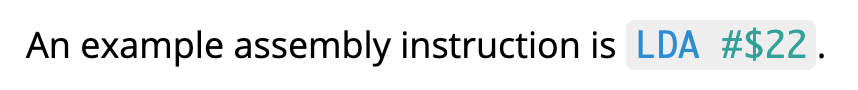

# markdown-it-prism-backticks

MarkdownIt plugin for highlighting inline code snippets using Prism.

## Quickstart

### Installation

Using npm:

```
npm install markdown-it-prism-backticks
```

Prism is a peer dependency of this plugin and must also be installed:

```
npm install prismjs
```

### Usage

Import it wherever you configure MarkdownIt and then use it as you would any other MarkdownIt plugin:

```js
import MarkdownIt from "markdown-it";
import markdownItPrismBackticks from "markdown-it-prism-backticks";

...

new MarkdownIt().use(markdownItPrismBackticks)
```

**Important!** You may also need to import Prism itself. If you are using the [markdown-it-prism](https://github.com/jGleitz/markdown-it-prism) plugin as well then you do not. If you are already importing Prism then you do not. If neither situation applies then you do need to import Prism:

```js
import "prismjs"; // Ensure the Prism global object is defined.
import MarkdownIt from "markdown-it";
import markdownItPrismBackticks from "markdown-it-prism-backticks";
```

Now you can add a language annotation to any inline backticks content that you want highlighted by Prism:

```markdown
An example assembly instruction is `LDA #$22`{lang=asm6502}.
```

The result is as expected:



The rules for the language annotation are simple:

- No whitespace between the closing backtick and the opening curly brace.
- No whitespace in the language annotation.

See [stevejay/middleengine-website](https://github.com/stevejay/middleengine-website) for an example of a repository that uses this plugin.

## Usage with other MarkdownIt plugins

This plugin can be used in conjunction with the [markdown-it-prism](https://github.com/jGleitz/markdown-it-prism) plugin. The latter highlights fenced code blocks while this plugin highlights inline backtick content.

This plugin plays well with the [markdown-it-attrs](https://www.npmjs.com/package/markdown-it-attrs) plugin. Any content in curly braces that does not match the `{lang=some-lang}` format is ignored by this plugin, and you can add extra curly brace content for markdown-it-attrs after the language setting:

```markdown
This is fine: `LDA #$22`{.someClass}.

This is also fine: `LDA #$22`{lang=asm6502}{.someClass}.
```

## Acknowledgements

The basic approach to parsing inline backticks comes from the [default parser in the MarkdownIt repository](https://github.com/markdown-it/markdown-it/blob/master/lib/rules_inline/backticks.js).

The structure of this repository comes from the [markdown-it-prism](https://github.com/jGleitz/markdown-it-prism) project.
